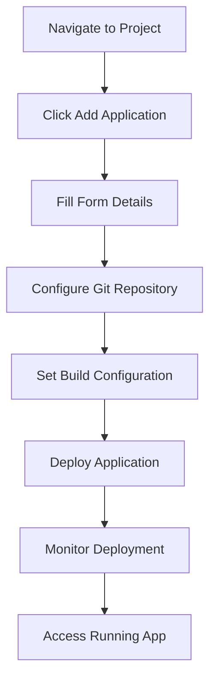
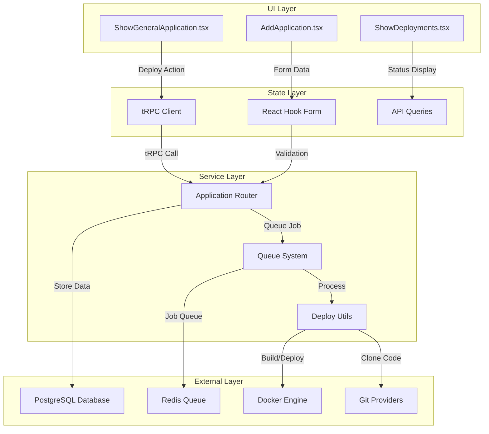
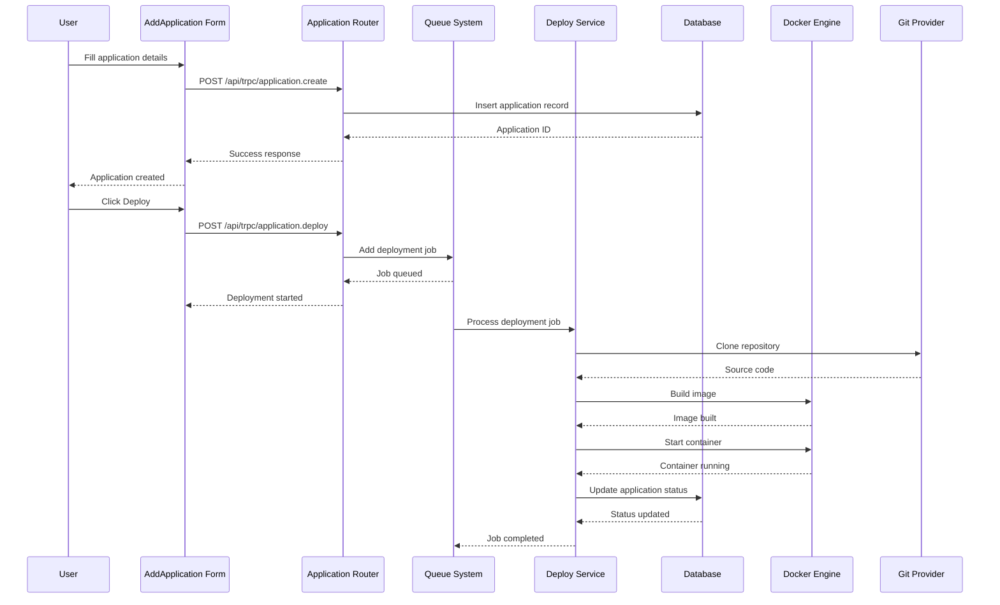

# Application Deployment Lifecycle

**Use Case**: Application Deployment and Management  
**User Story**: As a developer, I want to deploy my application from a Git repository to a production environment with automated build processes, monitoring, and scaling capabilities.

## Layer 1: User Journey



## Layer 2: Component Architecture



### Component Implementation Mapping

| Component | Implementation | File Location | Primary Function |
|-----------|---------------|---------------|------------------|
| UI1 | `AddApplication` | `/components/dashboard/project/add-application.tsx:59` | Application creation form |
| UI2 | `ShowGeneralApplication` | `/components/dashboard/application/general/show.tsx:44` | Deploy controls and status |
| UI3 | `ShowDeployments` | `/components/dashboard/application/deployments/show-deployments.tsx` | Deployment history |
| S1 | `api.application.*` | `/utils/api.ts` | tRPC client hooks |
| S2 | `useForm<AddTemplate>` | `/components/dashboard/project/add-application.tsx:71` | Form state management |
| SV1 | `applicationRouter` | `/server/api/routers/application.ts:1` | API route handlers |
| SV2 | `myQueue` | `/server/queues/queueSetup.ts:4` | Redis-based job queue |
| SV3 | `deploy()` | `/server/utils/deploy.ts:4` | Deployment orchestration |
| E1 | `applications` table | `/packages/server/src/db/schema/application.ts:100` | Application data model |

## Layer 3: Sequence Diagram



### Key Design Patterns

1. **Command Pattern**: Deployment actions are encapsulated as jobs in the queue system
2. **Observer Pattern**: Real-time status updates through WebSocket connections and polling
3. **Factory Pattern**: Different build types (Dockerfile, Nixpacks, etc.) handled by specialized builders

## Data Structures

```typescript
// Application creation payload
interface CreateApplicationInput {
  name: string;                    // Display name for the application
  appName: string;                 // Unique container/service name
  description?: string;            // Optional description
  projectId: string;              // Parent project reference
  serverId?: string;              // Target server (cloud only)
}

// Application database model
interface Application {
  applicationId: string;          // Primary key (nanoid)
  name: string;                   // Human readable name
  appName: string;               // Docker container name
  description?: string;           // Optional description
  buildType: BuildType;          // dockerfile | nixpacks | static | etc
  sourceType: SourceType;        // git | docker | github | gitlab | etc
  applicationStatus: Status;      // idle | running | stopped | error
  env?: string;                  // Environment variables (encrypted)
  buildPath: string;             // Path to build context
  dockerfile?: string;           // Custom dockerfile content
  // Git configuration
  repository?: string;           // Git repository URL
  owner?: string;               // Repository owner
  branch?: string;              // Git branch to deploy
  // Build configuration
  buildArgs?: string;           // Docker build arguments
  command?: string;             // Override container command
  // Resource limits
  memoryReservation?: number;   // Memory reservation in MB
  memoryLimit?: number;        // Memory limit in MB
  cpuLimit?: number;           // CPU limit
  // Timestamps
  createdAt: string;           // ISO timestamp
  projectId: string;           // Foreign key to project
}

// Deployment job structure
interface DeploymentJob {
  applicationId: string;         // Target application
  applicationType: "application"; // Job type discriminator
  type: "deploy" | "redeploy";   // Deployment mode
  titleLog: string;             // Log title for UI
  descriptionLog: string;       // Log description
  serverId?: string;            // Target server ID
  server?: boolean;             // Remote deployment flag
}
```

## Quick Reference

### Event Triggers
- **Create**: Form submission with validation
- **Deploy**: Manual button click or Git webhook
- **Redeploy**: Rebuild without source code changes
- **Start/Stop**: Container lifecycle management

### Data Formats
- **Environment Variables**: Key=Value pairs, encrypted at rest
- **Build Args**: Docker ARG format
- **Git URLs**: HTTPS or SSH format with authentication

### Error Handling
- **Validation Errors**: Form-level validation with Zod schemas
- **Deployment Errors**: Captured in deployment logs and status updates
- **Queue Failures**: Automatic retry with exponential backoff
- **Network Errors**: Timeout handling and connection retry

### Status States
- `idle` - Application created but not deployed
- `running` - Deployment in progress
- `done` - Successfully deployed and running
- `error` - Deployment failed
- `stopped` - Manually stopped

## Related Lifecycles

1. **002_lifecycle_docker_compose_deployment** - Multi-service application deployment
2. **003_lifecycle_database_provisioning** - Database service creation and management
3. **004_lifecycle_domain_configuration** - Custom domain and SSL certificate setup
4. **005_lifecycle_monitoring_and_alerting** - Application health monitoring
5. **006_lifecycle_backup_and_restore** - Data backup and disaster recovery

## Component Overview

### Key Components & Services

- **AddApplication**: React form component for creating new applications with validation
- **ShowGeneralApplication**: Main application management interface with deploy controls
- **ApplicationRouter**: tRPC router handling all application-related API endpoints
- **QueueSystem**: Redis-based job queue for asynchronous deployment processing
- **DeployService**: Core deployment logic handling builds, Git operations, and Docker management
- **DeploymentWorker**: Background worker processing deployment jobs with error handling
- **ApplicationSchema**: Database schema and validation for application data model