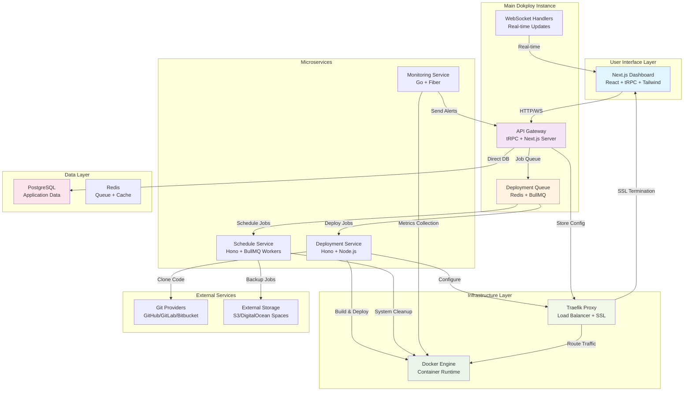

# Dokploy System Architecture

## 1. System Overview Diagram

## 2. Component Catalog

| Component | Technology/Framework | Primary Responsibility | Key Files | Heavy Logic |
|-----------|---------------------|----------------------|-----------|-------------|
| **Next.js Dashboard** | React + Next.js + tRPC + Tailwind | User interface and client-side state management | `apps/dokploy/pages/**`, `components/**` | Form validation, real-time UI updates, routing |
| **API Gateway** | tRPC + Next.js API Routes | Business logic coordination and authentication | `server/api/routers/**`, `server/server.ts` | Authentication, authorization, API orchestration |
| **Deployment Queue** | Redis + BullMQ | Asynchronous job processing and scheduling | `server/queues/**`, `server/utils/deploy.ts` | Job queuing, retry logic, worker coordination |
| **Deployment Service** | Hono + Node.js | Application build and deployment orchestration | `apps/api/src/**`, `packages/server/src/services/**` | Docker builds, Git operations, container management |
| **Schedule Service** | Hono + BullMQ Workers | Cron jobs and scheduled tasks | `apps/schedules/src/**` | Backup scheduling, system cleanup, recurring jobs |
| **Monitoring Service** | Go + Fiber | Resource monitoring and alerting | `apps/monitoring/**` | Metrics collection, threshold monitoring, notifications |
| **Traefik Proxy** | Traefik v3 + YAML Config | Load balancing and SSL termination | `packages/server/src/utils/traefik/**` | Dynamic routing, SSL certificate management, middleware |
| **Docker Engine** | Docker + Docker Swarm | Container orchestration and runtime | Native Docker API integration | Container lifecycle, image building, network management |
| **PostgreSQL Database** | PostgreSQL + Drizzle ORM | Persistent data storage | `packages/server/src/db/schema/**` | ACID transactions, relational data integrity |
| **Redis Cache** | Redis | Queue storage and caching | Queue configuration in services | Job persistence, real-time data caching |

## 3. Technology Stack

### UI Layer
- **Frontend**: Next.js 14, React 18, TypeScript
- **Styling**: Tailwind CSS, shadcn/ui components
- **State Management**: tRPC queries, React Hook Form
- **Real-time**: WebSocket connections for live updates

### State/Logic Layer  
- **API**: tRPC (type-safe RPC), Zod validation
- **Authentication**: Custom session-based auth
- **Real-time**: Native WebSocket handlers
- **Caching**: React Query (via tRPC)

### Service/API Layer
- **Main Service**: Next.js API routes + custom server
- **Microservices**: Hono.js (lightweight web framework)
- **Job Processing**: BullMQ (Redis-based queue)
- **Monitoring**: Go with Fiber web framework

### Data Layer
- **Primary Database**: PostgreSQL with Drizzle ORM
- **Cache/Queue**: Redis for job queues and caching
- **File Storage**: Local filesystem + external S3-compatible storage
- **Configuration**: YAML files for Traefik, JSON for app config

### External Dependencies
- **Git Providers**: GitHub, GitLab, Bitbucket, Gitea APIs
- **Container Registry**: Docker Hub, private registries
- **Storage**: AWS S3, DigitalOcean Spaces, MinIO
- **DNS/SSL**: Let's Encrypt, custom certificate providers

## 4. Integration Points

### API Gateway ↔ Microservices
- **Protocol**: HTTP REST with API key authentication
- **Data Format**: JSON payloads with Zod schema validation
- **Communication**: Async via job queues, sync for status checks

### Queue System ↔ Workers
- **Protocol**: Redis protocol via BullMQ
- **Data Format**: Serialized JSON job payloads
- **Communication**: Async message passing with retry logic

### Traefik ↔ Services
- **Protocol**: HTTP reverse proxy with dynamic configuration
- **Data Format**: YAML configuration files
- **Communication**: File-based configuration updates, Docker label discovery

### WebSocket Handlers ↔ Client
- **Protocol**: WebSocket over HTTP/HTTPS
- **Data Format**: JSON messages with event types
- **Communication**: Real-time bidirectional messaging

### Docker Integration
- **Protocol**: Docker Engine API over Unix socket/TCP
- **Data Format**: JSON API requests/responses
- **Communication**: Sync API calls for container operations

### Database Access
- **Protocol**: PostgreSQL wire protocol via connection pooling
- **Data Format**: SQL queries via Drizzle ORM
- **Communication**: Sync with connection pooling and transactions

## 5. Where to Start

### To understand user interactions:
- **Read**: `001_lifecycle_application_deployment.md` - Shows complete user journey from creation to deployment
- **Components**: `components/dashboard/project/add-application.tsx` for form handling
- **API Flow**: `server/api/routers/application.ts` for backend logic

### To understand data flow:
- **Start with**: API Gateway (`server/api/routers/**`) - Central orchestration point
- **Follow**: Queue System (`server/queues/queueSetup.ts`) for async processing
- **Trace**: Deployment Service (`apps/api/src/utils.ts`) for execution logic

### To understand business logic:
- **Start with**: Application Service (`packages/server/src/services/application.ts`)
- **Core Logic**: Build and deployment orchestration in `packages/server/src/utils/builders/**`
- **Infrastructure**: Traefik configuration in `packages/server/src/utils/traefik/**`

### To understand system architecture:
- **Entry Point**: `apps/dokploy/server/server.ts` - Main application bootstrap
- **Service Discovery**: Each service has its own `index.ts` or `main.go` entry point
- **Configuration**: Environment variables and YAML configs in respective service directories

## Key Architectural Patterns

### 1. **Microservices with Message Queues**
- Loose coupling between services via Redis queues
- Each service has single responsibility
- Async processing for long-running operations

### 2. **Event-Driven Architecture**
- WebSocket connections for real-time updates
- Queue-based job processing
- Event sourcing for deployment history

### 3. **Infrastructure as Code**
- Traefik configuration generated programmatically
- Docker containers managed via API
- YAML-based configuration management

### 4. **Multi-Tenant Design**
- Organization-based isolation
- Project-scoped resources
- Role-based access control

This architecture provides scalability, maintainability, and clear separation of concerns while supporting both self-hosted and cloud deployment models.